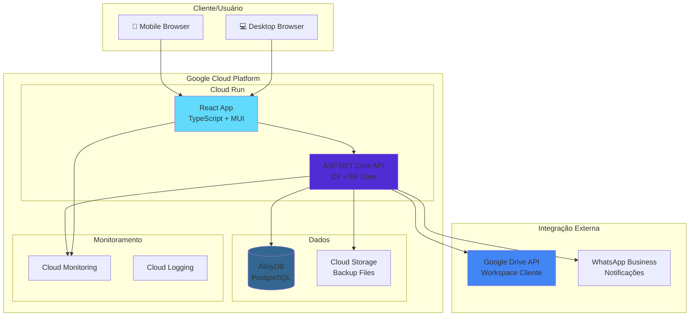

# ADR-002: Arquitetura Técnica da Aplicação

**Data:** 04/10/2025  
**Status:** Proposto  
**Contexto:** Casa Mãe Paulistana  
**Decisores:** Equipe CodeBoa Software

## Contexto e Problema

O projeto Casa Mãe Paulistana necessita de uma arquitetura técnica moderna, escalável e econômica para atender aos requisitos de:

1. **Formulário de Pré-Cadastro Público** - Interface web responsiva para cadastro de beneficiários
2. **Upload Seguro de Documentos** - Armazenamento de documentos pessoais (RG, laudos, comprovantes)
3. **Gestão de Dados** - Armazenamento estruturado de informações dos beneficiários
4. **Painel Administrativo** - Interface para equipe gerenciar cadastros e triagens
5. **Conformidade LGPD** - Tratamento seguro de dados pessoais
6. **Mobile-First** - Prioridade para dispositivos móveis

### Restrições
- **Orçamento limitado** - Necessário escolher soluções econômicas
- **Prazo apertado** - Primeira entrega em 22/10/2025
- **Escalabilidade** - Inicialmente pequeno volume, mas com potencial de crescimento
- **Manutenibilidade** - Equipe pequena de desenvolvimento

## Decisão

Adotaremos a seguinte arquitetura técnica:

### Frontend
- **React.js** com TypeScript
- **Deploy:** Google Cloud Run
- **Biblioteca UI:** Material-UI (MUI) ou Tailwind CSS
- **Build:** Vite ou Create React App

### Backend
- **ASP.NET Core 8** (C#) com Web API
- **Deploy:** Google Cloud Run
- **Autenticação:** JWT + ASP.NET Identity
- **Documentação API:** Swagger/OpenAPI

### Banco de Dados
- **AlloyDB for PostgreSQL** (Google Cloud)
- **ORM:** Entity Framework Core
- **Migrations:** EF Core Migrations

### Armazenamento de Arquivos
- **Estratégia Híbrida:**
  1. **Primário:** Google Drive API (Workspace do cliente)
  2. **Backup/Temporário:** Google Cloud Storage
  3. **CDN:** Google Cloud CDN para assets estáticos

### Infraestrutura (Google Cloud)
- **Compute:** Cloud Run (Frontend + Backend)
- **Database:** AlloyDB for PostgreSQL
- **Storage:** Cloud Storage + Google Drive API
- **Monitoring:** Cloud Monitoring
- **CI/CD:** Cloud Build + GitHub Actions

## Diagrama da Arquitetura

## Consequências

### Positivas
- **React + TypeScript:** Ecossistema maduro, boa experiência de desenvolvimento
- **ASP.NET Core:** Performance excelente, integração nativa com Google Cloud
- **AlloyDB:** PostgreSQL compatível com melhor performance que Cloud SQL
- **Cloud Run:** Serverless, pague apenas pelo uso, auto-scaling
- **Google Drive API:** Integração direta com workspace do cliente, familiar para usuários
- **Arquitetura Desacoplada:** Frontend e Backend independentes, facilita manutenção

### Negativas
- **Curva de Aprendizado:** Equipe precisa conhecer .NET + Google Cloud
- **Vendor Lock-in:** Dependência do ecossistema Google Cloud
- **Google Drive API:** Limites de API podem ser restritivos com alto volume
- **Complexidade Inicial:** Configuração de múltiplos serviços

### Riscos Mitigados
- **Backup Storage:** Cloud Storage como fallback para Google Drive
- **Monitoramento:** Visibilidade completa da aplicação
- **Escalabilidade:** Cloud Run escala automaticamente

## Alternativas Consideradas

### 1. **AWS com Node.js**
- **Prós:** Ecossistema maduro, experiência da equipe
- **Contras:** Custos maiores, menos integrado com Google Workspace

### 2. **Azure com .NET**
- **Prós:** Integração nativa .NET, preços competitivos
- **Contras:** Menor integração com Google Drive, complexidade de setup

### 3. **Vercel + Supabase**
- **Prós:** Deploy simples, preços baixos para MVP
- **Contras:** Menor controle, limitações de escalabilidade

## Estimativa de Custos (USD/mês)

### Cenário Econômico Otimizado (3.000 cadastros/mês)

**Premissa:** Uptime apenas em horário comercial (Segunda-Sexta, 8h-18h)

| Componente | Configuração | Custo USD | Custo BRL* |
|-----------|--------------|-----------|------------|
| AlloyDB PostgreSQL | 1 vCPU, 4GB RAM, 220h/mês | $45 | R$ 252 |
| Cloud Run Backend | 512MB, 1 vCPU | $5 | R$ 28 |
| Cloud Run Frontend | 512MB, 1 vCPU | $3 | R$ 17 |
| Cloud Storage | Backup c/ lifecycle | $0.55 | R$ 3 |
| Cloud Monitoring | Free tier | $0 | R$ 0 |
| Google Drive API | Workspace cliente | $0 | R$ 0 |
| Margem de Contingência | +15% buffer | $8 | R$ 45 |
| **TOTAL** | | **$61.55** | **R$ 345** |

*Taxa de câmbio: USD 1 = BRL 5,60

**Custo por cadastro:** R$ 0,12  
**Economia vs 24/7:** 76% de redução

### Cenário de Crescimento (6.000 cadastros/mês)

| Componente | Configuração | Custo BRL* |
|-----------|--------------|------------|
| AlloyDB PostgreSQL | 2 vCPUs, 6GB RAM | R$ 427 |
| Cloud Run Backend | 1GB, 1 vCPU | R$ 45 |
| Cloud Run Frontend | 512MB, 1 vCPU | R$ 22 |
| Cloud Storage | Backup | R$ 6 |
| **TOTAL** | | **R$ 520** |

**Custo por cadastro:** R$ 0,09 (economia de escala)

### Trade-offs da Configuração Econômica

**✅ Vantagens:**
- Custo extremamente competitivo (R$ 0,12/cadastro)
- ROI excepcional (payback em horas)
- Escalabilidade automática mantida

**⚠️ Considerações:**
- Cold starts de 2-3s na primeira requisição do dia
- AlloyDB offline fora do horário comercial
- Logs limitados ao free tier (150MB/mês)

**Para análise detalhada, consulte:** `docs/analise-custos-otimizada.md`

## Próximos Passos

1. **Setup do Projeto**
   - [ ] Criar repositórios GitHub
   - [ ] Configurar Google Cloud Project
   - [ ] Setup inicial do React + .NET

2. **Infraestrutura**
   - [ ] Provisionar AlloyDB
   - [ ] Configurar Cloud Run services
   - [ ] Setup Google Drive API

3. **Desenvolvimento**
   - [ ] Implementar formulário React
   - [ ] Desenvolver API .NET
   - [ ] Integrar upload de documentos

## Referências

- [Google Cloud Run Pricing](https://cloud.google.com/run/pricing)
- [AlloyDB Documentation](https://cloud.google.com/alloydb/docs)
- [Google Drive API Documentation](https://developers.google.com/drive)
- [ASP.NET Core on Google Cloud](https://cloud.google.com/dotnet/docs)