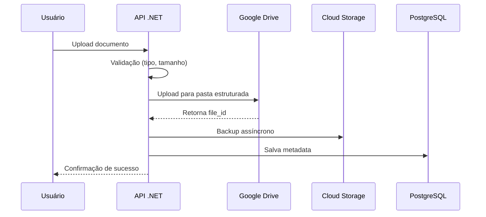

# ADR-003: Estratégia de Armazenamento de Documentos

**Data:** 04/10/2025  
**Status:** Proposto
**Contexto:** Casa Mãe Paulistana  
**Decisores:** Equipe CodeBoa Software

## Contexto e Problema

O sistema Casa Mãe Paulistana precisa armazenar documentos sensíveis dos beneficiários (RG, laudos médicos, comprovantes de residência) de forma:

- **Econômica** - Orçamento limitado, especialmente no início
- **Segura** - Conformidade com LGPD e proteção de dados pessoais
- **Escalável** - Suportar crescimento de centenas para milhares de beneficiários
- **Confiável** - Alta disponibilidade e backup automático
- **Integrada** - Fácil acesso pela equipe administrativa

### Requisitos Específicos
- Upload via web (mobile-first)
- Formatos: PDF, JPG, PNG
- Tamanho máximo: 10MB por arquivo (revisado para acomodar PDFs e fotos)
- 4 documentos obrigatórios por beneficiário
- Volume estimado: 3000 acessos/mês = 12000 uploads/mês
- Acesso controlado pela equipe administrativa
- Conformidade LGPD (direito ao esquecimento, portabilidade)

## Decisão

Adotaremos uma **estratégia híbrida** de armazenamento:

### Componentes da Solução

1. **Google Drive API (Storage Primário)**
   - Utilizar Google Workspace existente do cliente
   - Custo zero para armazenamento
   - Interface familiar para equipe administrativa

2. **Google Cloud Storage (Backup/Failover)**
   - Backup automático de todos os documentos
   - Fallback caso Google Drive esteja indisponível
   - Lifecycle policies para otimização de custos

3. **PostgreSQL (Metadata)**
   - Índices e busca eficiente
   - Controle de acesso granular
   - Audit trail completo

### Fluxo de Armazenamento



### Estrutura de Organização

**Google Drive:**
```
Casa Mãe Paulistana/
├── 2025/
│   ├── Janeiro/
│   │   ├── Beneficiario-001/
│   │   └── Beneficiario-002/
│   └── Fevereiro/
├── Backups/
└── Templates/
```

**Metadata PostgreSQL:**
```sql
CREATE TABLE documentos (
    id SERIAL PRIMARY KEY,
    beneficiario_id INT,
    tipo_documento VARCHAR(50),
    nome_arquivo VARCHAR(255),
    google_drive_file_id VARCHAR(100),
    cloud_storage_path VARCHAR(500),
    tamanho_bytes BIGINT,
    uploaded_at TIMESTAMP,
    status VARCHAR(20)
);
```

## Consequências

### Positivas
- **Custo ultra baixo** - ~$3.50/mês para 1000 beneficiários
- **Zero setup de infraestrutura** - Google Workspace já existe
- **Familiar para equipe** - Interface Google Drive conhecida
- **Backup automático** - Redundância garantida
- **Escalabilidade** - Suporta crescimento orgânico
- **Conformidade LGPD** - APIs de exclusão e portabilidade

### Negativas
- **Dependência do Google Workspace** - Requer conta ativa
- **Limites de API** - 1000 requests/100s (suficiente para uso estimado)
- **Complexidade inicial** - Integração com duas APIs de storage
- **Vendor lock-in** - Migração futura seria complexa

### Riscos Mitigados
- **Falha do Google Drive** → Cloud Storage como backup
- **Perda de dados** → Replicação automática em múltiplas regiões
- **Limite de API** → Rate limiting e retry policies
- **Custos inesperados** → Monitoramento proativo com alertas

## Alternativas Consideradas

### 1. Apenas Google Cloud Storage
**Prós:** Controle total, pricing previsível  
**Contras:** Custos maiores ($15-25/mês), interface menos amigável

### 2. Apenas Google Drive
**Prós:** Custo zero, interface familiar  
**Contras:** Sem backup independente, dependência única

### 3. AWS S3 + CloudFront
**Prós:** Ecossistema maduro, performance excelente  
**Contras:** Custos significativamente maiores, curva de aprendizado

### 4. Azure Blob Storage
**Prós:** Integração nativa com .NET  
**Contras:** Sem integração com Google Workspace, custos maiores

## Implementação

### Fase 1: Setup Básico
```csharp
// Google Drive API Service
services.AddSingleton<DriveService>(provider =>
{
    var credential = GoogleCredential.FromFile("service-account.json")
        .CreateScoped(DriveService.Scope.Drive);
    return new DriveService(new BaseClientService.Initializer()
    {
        HttpClientInitializer = credential
    });
});

// Cloud Storage Client
services.AddSingleton<StorageClient>(provider =>
    StorageClient.Create(GoogleCredential.FromFile("service-account.json"))
);
```

### Fase 2: Service de Upload
```csharp
public async Task<DocumentoUploadResult> UploadDocumento(
    IFormFile file, 
    int beneficiarioId, 
    TipoDocumento tipo)
{
    // 1. Validação
    ValidateFile(file, tipo);
    
    // 2. Upload para Google Drive
    var driveFileId = await UploadToGoogleDrive(file, beneficiarioId);
    
    // 3. Backup para Cloud Storage (async)
    _ = Task.Run(() => BackupToCloudStorage(file, driveFileId));
    
    // 4. Salvar metadata
    await SaveMetadata(beneficiarioId, tipo, driveFileId, file);
    
    return new DocumentoUploadResult { Success = true, FileId = driveFileId };
}
```

## Estimativa de Custos Detalhada (3000 acessos/mês)

### Cálculo de Volume
- **Acessos mensais:** 3000
- **Documentos por acesso:** 4 obrigatórios
- **Total uploads/mês:** 12000 arquivos
- **Tamanho médio estimado:** 3MB por arquivo
- **Volume mensal total:** ~36GB
- **Volume anual acumulado:** ~432GB

### Custos Google Drive API
- **Storage:** $0 (incluído no Google Workspace)
- **API Calls:** 12000 uploads + ~6000 downloads = 18000 calls/mês
- **Quota gratuita:** 1 bilhão calls/dia (suficiente)
- **Custo:** $0/mês

### Custos Cloud Storage (Backup)
- **Storage Standard:** 36GB × $0.020 = $0.72/mês
- **Operações:** 12000 writes × $0.005/1000 = $0.06/mês
- **Egress (ocasional):** ~1GB × $0.12 = $0.12/mês
- **Total Cloud Storage:** $0.90/mês

### Monitoramento e Custos

### Métricas Importantes
- Número de uploads/dia (~400 uploads)
- Tamanho total de storage utilizado (~36GB/mês)
- Latência de upload/download
- Taxa de erro de API
- Custos mensais por serviço

### Alertas Configurados
- Storage > 100GB → Revisar lifecycle policies
- Custos > $50/mês → Investigar uso anômalo
- Taxa de erro > 5% → Verificar conectividade/quotas
- Backup falhou → Alertar equipe técnica

## Plano de Contingência

### Cenário: Google Workspace Descontinuado
1. Migração automática para Cloud Storage como primário
2. Manter metadata no PostgreSQL (sem impacto)
3. Ajustar interface administrativa
4. Custo estimado: +$25-35/mês (baseado em 432GB anuais)

### Cenário: Limite de API Excedido
1. Implementar rate limiting mais agressivo
2. Usar Cloud Storage como overflow temporário
3. Considerar upgrade do Google Workspace se necessário

## Conformidade LGPD

### Implementações Obrigatórias
```csharp
// Direito ao esquecimento
public async Task ExcluirDadosBeneficiario(int beneficiarioId)
{
    var documentos = await GetDocumentosByBeneficiario(beneficiarioId);
    
    foreach (var doc in documentos)
    {
        // Excluir do Google Drive
        await _driveService.Files.Delete(doc.GoogleDriveFileId).ExecuteAsync();
        
        // Excluir do Cloud Storage
        await _storageClient.DeleteObjectAsync(_bucketName, doc.CloudStoragePath);
    }
    
    // Anonimizar dados no PostgreSQL
    await AnonimizarBeneficiario(beneficiarioId);
}

// Portabilidade de dados
public async Task<byte[]> ExportarDadosBeneficiario(int beneficiarioId)
{
    // Gerar ZIP com todos os documentos + JSON com metadata
}
```

## Revisão e Aprovação

Esta decisão será revisada em:
- **30 dias** após implementação (validar custos reais)
- **6 meses** de operação (avaliar escalabilidade)
- **Anualmente** ou quando houver mudanças significativas nos requisitos

## Referências

- [Google Drive API Documentation](https://developers.google.com/drive/api)
- [Cloud Storage Pricing](https://cloud.google.com/storage/pricing)
- [LGPD - Lei Geral de Proteção de Dados](https://www.planalto.gov.br/ccivil_03/_ato2015-2018/2018/lei/l13709.htm)
- [Estratégia Detalhada de Armazenamento](../docs/estrategia-armazenamento.md)