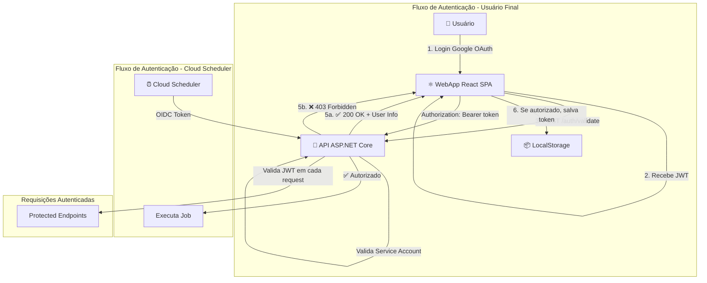

# ADR-004: Arquitetura de Autenticação JWT para CIPCD

**Data:** 13/01/2025  
**Status:** Aprovado  
**Contexto:** CIPCD (Projeto Cliente ITS)  
**Decisores:** @LucasGeddy, Equipe CodeBoa

## Contexto e Problema

O projeto CIPCD possui uma API e um WebApp rodando no Google Cloud Run. Até agora, a API estava com acesso aberto para facilitar testes. Com o lançamento em produção, é necessário implementar autenticação adequada para:

1. **Proteger a API** contra acessos não autorizados
2. **Restringir acesso** apenas a usuários autorizados do ITS (cliente) e equipe CodeBoa
3. **Manter compliance com LGPD** para proteção de dados pessoais
4. **Permitir chamadas do Cloud Scheduler** para automações

### Requisitos de Segurança

- Validação de usuários através de domínios/emails permitidos
- Auditoria completa de tentativas de acesso
- Suporte a diferentes configurações por ambiente (dev/staging/prod)
- Autenticação de Service Accounts para jobs automatizados
- Zero exposição de credenciais no frontend

## Alternativas Consideradas

### ❌ Opção 1: API Key no Frontend
**Descrição:** Utilizar uma API Key estática compartilhada entre usuários, armazenada no código JavaScript.

**Prós:**
- Implementação simples e rápida
- Baixa complexidade inicial

**Contras:**
- **Crítico:** Chave exposta no código JavaScript (facilmente extraível)
- Sem controle granular de usuários
- Difícil rotação de credenciais
- Não atende requisitos de auditoria

**Motivo da rejeição:** Vulnerabilidade de segurança inaceitável para produção.

### ❌ Opção 2: Validação de Email Apenas no Frontend
**Descrição:** Implementar controle de acesso baseado em validação de email/domínio apenas no código React.

**Prós:**
- UX rápida e responsiva
- Sem latência de validação

**Contras:**
- **Crítico:** Usuário malicioso pode burlar JavaScript facilmente
- Sem segurança real na API
- Dados expostos para qualquer pessoa com token Google válido

**Motivo da rejeição:** Não fornece segurança real, apenas UX.

### ❌ Opção 3: Backend-for-Frontend (BFF)
**Descrição:** Criar camada intermediária Node.js/Next.js entre WebApp e API para gerenciar autenticação.

**Prós:**
- Isolamento completo de lógica de autenticação
- Controle fino de sessões
- Padrão de mercado para SPAs complexos

**Contras:**
- WebApp atual é React SPA puro (sem backend Node.js)
- Aumentaria complexidade arquitetural significativamente
- Custos adicionais de infraestrutura (mais um serviço no Cloud Run)
- Overhead de desenvolvimento e manutenção

**Motivo da rejeição:** WebApp é SPA puro, adicionar BFF seria over-engineering para este cenário.

## Decisão

Implementar autenticação baseada em **Google OAuth com JWT** e validação centralizada via endpoint dedicado na API.

### Arquitetura Escolhida



### Componentes da Solução

#### 1. Google OAuth (Identity Provider)
- Autenticação de usuários via contas Google
- Tokens JWT emitidos e assinados pelo Google
- Expiração automática gerenciada pelo Google
- Sem necessidade de gerenciar senhas

#### 2. Endpoint `/auth/validate` na API
- Valida tokens JWT do Google OAuth
- Verifica email/domínio contra lista permitida
- Retorna dados do usuário se autorizado
- Registra logs de auditoria

#### 3. Middleware JWT Bearer Authentication
- Configurado no ASP.NET Core
- Valida todos os requests protegidos
- Suporta tokens de usuários e Service Accounts
- Rejeita automaticamente tokens inválidos/expirados

#### 4. Configuração por Ambiente
- Development/Staging: Lista de emails permitidos (equipe CodeBoa)
- Production: Domínio permitido (`educacaoadistancia.org.br`)

## Implementação

### 1. API (C# - ASP.NET Core)

#### Endpoint `/auth/validate`

```csharp
[ApiController]
[Route("api/auth")]
public class AuthController : ControllerBase
{
    private readonly IConfiguration _config;
    private readonly IAuditLogService _auditLog;

    [HttpPost("validate")]
    [AllowAnonymous]
    public async Task<ActionResult<UserInfo>> ValidateToken([FromBody] TokenValidationRequest request)
    {
        try
        {
            // 1. Validar JWT com Google
            var payload = await GoogleJsonWebSignature.ValidateAsync(request.Token);
            
            // 2. Obter configurações do ambiente
            var allowedDomains = _config.GetSection("Auth:AllowedDomains").Get<List<string>>();
            var allowedEmails = _config.GetSection("Auth:AllowedEmails").Get<List<string>>();
            
            // 3. Verificar autorização
            var email = payload.Email;
            var domain = email.Split('@')[1];
            
            bool isAuthorized = false;
            
            if (allowedDomains?.Contains(domain) == true)
            {
                isAuthorized = true;
            }
            else if (allowedEmails?.Contains(email) == true)
            {
                isAuthorized = true;
            }
            
            // 4. Registrar tentativa de acesso
            await _auditLog.LogAccessAttempt(new AccessLog
            {
                Email = email,
                Success = isAuthorized,
                Timestamp = DateTime.UtcNow,
                IpAddress = HttpContext.Connection.RemoteIpAddress?.ToString()
            });
            
            // 5. Retornar resultado
            if (isAuthorized)
            {
                return Ok(new UserInfo 
                { 
                    Email = email,
                    Name = payload.Name,
                    Picture = payload.Picture
                });
            }
            else
            {
                return StatusCode(403, new { message = "Acesso negado. Email/domínio não autorizado." });
            }
        }
        catch (Exception ex)
        {
            await _auditLog.LogError("Token validation failed", ex);
            return StatusCode(401, new { message = "Token inválido ou expirado." });
        }
    }
}
```

#### Middleware JWT Bearer Authentication

```csharp
// Program.cs ou Startup.cs
services.AddAuthentication(JwtBearerDefaults.AuthenticationScheme)
    .AddJwtBearer(options =>
    {
        options.Authority = "https://accounts.google.com";
        options.Audience = Configuration["Auth:GoogleClientId"];
        options.TokenValidationParameters = new TokenValidationParameters
        {
            ValidateIssuer = true,
            ValidIssuer = "https://accounts.google.com",
            ValidateAudience = true,
            ValidAudience = Configuration["Auth:GoogleClientId"],
            ValidateLifetime = true
        };
        
        // Suporte para Service Account tokens (Cloud Scheduler)
        options.Events = new JwtBearerEvents
        {
            OnTokenValidated = async context =>
            {
                // Validação adicional de email/domínio aqui se necessário
                var email = context.Principal?.FindFirst(ClaimTypes.Email)?.Value;
                // Lógica de autorização...
            }
        };
    });

// Proteger todos os endpoints
app.UseAuthentication();
app.UseAuthorization();

// Nos controllers
[Authorize]
[ApiController]
[Route("api/[controller]")]
public class BeneficiarioController : ControllerBase
{
    // Endpoints protegidos automaticamente
}
```

#### Configuração por Ambiente

**appsettings.Development.json**
```json
{
  "Auth": {
    "GoogleClientId": "xxx.apps.googleusercontent.com",
    "AllowedDomains": [],
    "AllowedEmails": [
      "sussermann@gmail.com",
      "lucas.sussermann@gmail.com",
      "salima.thais@gmail.com",
      "elisa.castilho.marques@gmail.com",
      "sa.lucasf@gmail.com"
    ]
  }
}
```

**appsettings.Production.json**
```json
{
  "Auth": {
    "GoogleClientId": "xxx.apps.googleusercontent.com",
    "AllowedDomains": ["educacaoadistancia.org.br"],
    "AllowedEmails": []
  }
}
```

### 2. WebApp (React + TypeScript)

#### Fluxo de Autenticação

```typescript
// auth.service.ts
import { GoogleOAuthProvider, useGoogleLogin } from '@react-oauth/google';

class AuthService {
  private apiBaseUrl = process.env.REACT_APP_API_URL;

  async login(): Promise<UserInfo | null> {
    try {
      // 1. Usuário faz login com Google OAuth
      const token = await this.getGoogleToken();
      
      // 2. ANTES de salvar, valida com a API
      const response = await axios.post(`${this.apiBaseUrl}/auth/validate`, {
        token: token
      });
      
      if (response.status === 200) {
        // 3. Autorizado: salva token e dados do usuário
        localStorage.setItem('jwt_token', token);
        localStorage.setItem('user_info', JSON.stringify(response.data));
        return response.data;
      }
    } catch (error) {
      if (error.response?.status === 403) {
        // 4. Acesso negado: exibe mensagem
        throw new Error('Acesso negado. Você não tem permissão para acessar este sistema.');
      } else {
        throw new Error('Erro ao validar autenticação.');
      }
    }
    
    return null;
  }
  
  logout(): void {
    localStorage.removeItem('jwt_token');
    localStorage.removeItem('user_info');
  }
  
  getToken(): string | null {
    return localStorage.getItem('jwt_token');
  }
  
  isAuthenticated(): boolean {
    return !!this.getToken();
  }
}

export const authService = new AuthService();
```

#### Interceptor Axios

```typescript
// api.config.ts
import axios from 'axios';
import { authService } from './auth.service';

const api = axios.create({
  baseURL: process.env.REACT_APP_API_URL
});

// Interceptor de Request: Adiciona token em todas as requisições
api.interceptors.request.use(
  (config) => {
    const token = authService.getToken();
    if (token) {
      config.headers.Authorization = `Bearer ${token}`;
    }
    return config;
  },
  (error) => {
    return Promise.reject(error);
  }
);

// Interceptor de Response: Trata erros de autenticação globalmente
api.interceptors.response.use(
  (response) => response,
  (error) => {
    if (error.response?.status === 401 || error.response?.status === 403) {
      // Token expirado ou acesso negado
      authService.logout();
      window.location.href = '/login';
    }
    return Promise.reject(error);
  }
);

export default api;
```

#### Componente de Login

```tsx
// LoginPage.tsx
import { GoogleLogin } from '@react-oauth/google';
import { authService } from './services/auth.service';

const LoginPage: React.FC = () => {
  const navigate = useNavigate();
  const [error, setError] = useState<string | null>(null);

  const handleGoogleSuccess = async (credentialResponse: any) => {
    try {
      const userInfo = await authService.login(credentialResponse.credential);
      if (userInfo) {
        navigate('/dashboard');
      }
    } catch (err) {
      setError(err.message);
    }
  };

  return (
    <div className="login-container">
      <h1>Login - CIPCD</h1>
      
      <GoogleLogin
        onSuccess={handleGoogleSuccess}
        onError={() => setError('Erro ao fazer login com Google')}
      />
      
      {error && (
        <div className="error-message">
          {error}
        </div>
      )}
    </div>
  );
};
```

#### Configuração de Variáveis de Ambiente

```bash
# .env.development
REACT_APP_API_URL=http://localhost:5000/api
REACT_APP_GOOGLE_CLIENT_ID=xxx.apps.googleusercontent.com

# .env.production
REACT_APP_API_URL=https://cipcd-api.run.app/api
REACT_APP_GOOGLE_CLIENT_ID=xxx.apps.googleusercontent.com
```

### 3. Cloud Scheduler - Configuração OIDC

#### Criar Service Account

```bash
# 1. Criar Service Account dedicada para o Scheduler
gcloud iam service-accounts create cipcd-scheduler \
  --display-name="CIPCD Cloud Scheduler Service Account"

# 2. Conceder permissão de invocar Cloud Run
gcloud run services add-iam-policy-binding cipcd-api \
  --member="serviceAccount:cipcd-scheduler@PROJECT_ID.iam.gserviceaccount.com" \
  --role="roles/run.invoker" \
  --region=us-central1
```

#### Configurar Job com OIDC Authentication

```bash
# Exemplo: Job que roda a cada 6 horas
gcloud scheduler jobs create http cipcd-sync-data \
  --schedule="0 */6 * * *" \
  --uri="https://cipcd-api.run.app/api/jobs/sync" \
  --http-method=POST \
  --oidc-service-account-email=cipcd-scheduler@PROJECT_ID.iam.gserviceaccount.com \
  --oidc-token-audience="https://cipcd-api.run.app" \
  --location=us-central1
```

#### Validação na API

```csharp
// A validação acontece automaticamente via middleware JWT Bearer
// O Cloud Scheduler envia um token OIDC válido que será validado
[Authorize]
[HttpPost("jobs/sync")]
public async Task<ActionResult> SyncData()
{
    // Verificar se é uma Service Account (opcional)
    var email = User.FindFirst(ClaimTypes.Email)?.Value;
    
    if (!email.Contains("@PROJECT_ID.iam.gserviceaccount.com"))
    {
        return Forbid();
    }
    
    // Executar job
    await _jobService.SyncData();
    return Ok();
}
```

## Consequências

### Positivas

✅ **Segurança em Camadas**: WebApp valida UX, API garante segurança real  
✅ **Sem Exposição de Credenciais**: Lista de emails apenas no backend  
✅ **Auditoria Completa**: Logs de todas as tentativas de acesso  
✅ **Flexibilidade**: Configuração por ambiente (dev/staging/prod)  
✅ **Padrão de Mercado**: JWT + OAuth é amplamente adotado  
✅ **LGPD Compliant**: Controle adequado de acesso a dados pessoais  
✅ **Tokens Expirantes**: Gerenciado automaticamente pelo Google  
✅ **Zero Manutenção de Senhas**: Google gerencia credenciais  
✅ **Escalável**: Suporta crescimento sem mudanças arquiteturais  
✅ **Service Accounts**: Suporte nativo para automações

### Negativas

⚠️ **Dependência do Google**: Requer contas Google para usuários finais  
⚠️ **Latência Adicional**: Validação adiciona ~200-300ms na primeira requisição  
⚠️ **Complexidade de Setup**: Requer configuração OAuth no Google Cloud Console  
⚠️ **Lista de Emails Manual**: Necessário atualizar configuração para novos usuários (dev/staging)

### Mitigações

- **Dependência do Google**: Aceitável dado que o cliente ITS já usa Google Workspace
- **Latência**: Token validado apenas uma vez, depois armazenado localmente
- **Complexidade**: Documentação clara e templates de configuração
- **Lista Manual**: Em produção usa domínio (automático), dev/staging é temporário

## Considerações de Segurança

### 1. Expiração de Tokens
- Tokens Google OAuth expiram automaticamente (geralmente 1 hora)
- WebApp deve tratar expiração e solicitar novo login
- Sem necessidade de refresh tokens para este caso de uso

### 2. Validação na API
- **Nunca confiar apenas no frontend**: API valida cada token
- Impossível burlar validação de domínio/email
- Middleware valida automaticamente todos os endpoints protegidos

### 3. Logs de Auditoria
- Registrar todas as tentativas de acesso (sucesso e falha)
- Incluir: email, timestamp, IP, resultado
- Conformidade com LGPD (rastreabilidade)

### 4. Service Accounts com Permissões Mínimas
- Princípio do menor privilégio
- Cada Service Account com permissão apenas para seu job específico
- Audience validation previne reuso de tokens

### 5. HTTPS Obrigatório
- Todos os endpoints devem usar HTTPS
- Cloud Run força HTTPS automaticamente
- Tokens nunca transmitidos em plain text

### 6. Proteção Contra Ataques Comuns

**Token Replay:**
- Tokens têm validade curta
- Validação de issuer e audience previne reuso malicioso

**Man-in-the-Middle:**
- HTTPS/TLS obrigatório
- Certificados gerenciados pelo Google Cloud

**Brute Force:**
- Rate limiting no Cloud Run
- Logs de tentativas falhadas

## Conformidade LGPD

### Princípios Atendidos

1. **Finalidade**: Autenticação e autorização de acesso
2. **Adequação**: Método compatível com a finalidade
3. **Necessidade**: Mínimo de dados necessários (apenas email)
4. **Transparência**: Usuário sabe quais dados são coletados
5. **Segurança**: Criptografia e controle de acesso adequados

### Dados Pessoais Tratados

- **Email**: Identificação do usuário
- **Nome**: Exibição na interface (opcional)
- **Foto**: Avatar na interface (opcional)
- **IP**: Logs de auditoria

### Direitos do Titular

- **Acesso**: Logs disponíveis para consulta
- **Correção**: Gerenciado pelo Google (conta Google)
- **Exclusão**: Remoção do email da lista de permitidos
- **Portabilidade**: Logs exportáveis em formato estruturado

### Retenção de Dados

- **Tokens**: Não armazenados (apenas validados)
- **Logs de Acesso**: 90 dias (configurável)
- **Configuração de Emails**: Enquanto usuário tiver acesso ativo

## Plano de Implementação

### Fase 1: API - Autenticação Base (Sprint 1)
- [ ] Instalar pacotes NuGet necessários (`Google.Apis.Auth`, `Microsoft.AspNetCore.Authentication.JwtBearer`)
- [ ] Configurar JWT Bearer Authentication no Program.cs
- [ ] Criar modelo de configuração para Auth (appsettings)
- [ ] Criar endpoint `/auth/validate`
- [ ] Implementar serviço de auditoria de acessos
- [ ] Testes unitários de validação de tokens

### Fase 2: API - Proteção de Endpoints (Sprint 1)
- [ ] Adicionar `[Authorize]` em todos os controllers
- [ ] Criar exceções para endpoints públicos (se houver)
- [ ] Testar fluxo completo com token válido/inválido
- [ ] Configurar diferentes appsettings por ambiente

### Fase 3: WebApp - Integração OAuth (Sprint 2)
- [ ] Instalar biblioteca `@react-oauth/google`
- [ ] Criar serviço de autenticação
- [ ] Implementar página de login com Google OAuth
- [ ] Configurar interceptor Axios
- [ ] Implementar tratamento de erros 401/403
- [ ] Testar fluxo completo end-to-end

### Fase 4: WebApp - UX e Refinamentos (Sprint 2)
- [ ] Página de acesso negado customizada
- [ ] Loading states durante autenticação
- [ ] Protected routes no React Router
- [ ] Logout e limpeza de sessão
- [ ] Testes E2E com Cypress/Playwright

### Fase 5: Cloud Scheduler (Sprint 3)
- [ ] Criar Service Account para Scheduler
- [ ] Configurar permissões IAM
- [ ] Criar jobs com OIDC authentication
- [ ] Validar tokens de Service Account na API
- [ ] Testar execução de jobs

### Fase 6: Monitoramento e Documentação (Sprint 3)
- [ ] Configurar alertas para falhas de autenticação
- [ ] Dashboard de logs de acesso no Cloud Logging
- [ ] Documentação para adicionar novos usuários
- [ ] Runbook para troubleshooting de autenticação

## Issues Relacionadas

- #52 - [API] Implementar autenticação JWT e endpoint de validação
- #103 - [WebApp] Implementar fluxo de autenticação
- #51 - [Infra] Configurar Cloud Scheduler com OIDC

## Referências

- [Google OAuth Documentation](https://developers.google.com/identity/protocols/oauth2)
- [JWT Bearer Authentication - ASP.NET Core](https://learn.microsoft.com/en-us/aspnet/core/security/authentication/)
- [Google OIDC for Cloud Run](https://cloud.google.com/run/docs/authenticating/service-to-service)
- [React OAuth Google Library](https://www.npmjs.com/package/@react-oauth/google)
- [LGPD - Lei Geral de Proteção de Dados](http://www.planalto.gov.br/ccivil_03/_ato2015-2018/2018/lei/l13709.htm)

## Histórico de Revisões

| Data       | Autor        | Mudanças                          |
|------------|--------------|-----------------------------------|
| 13/01/2025 | @LucasGeddy  | Criação inicial do documento      |
