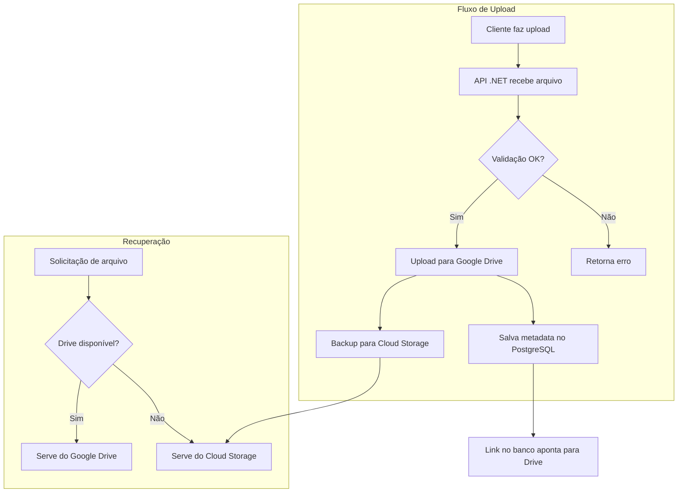

# Estratégias de Armazenamento - Casa Mãe Paulistana

**Data:** 04/10/2025  
**Projeto:** Casa Mãe Paulistana  
**Responsável:** CodeBoa Software

---

#### Análise do Limite de Tamanho de Arquivo

| Tipo de Documento | Tamanho Típico | Tamanho Máximo Observado | Recomendação |
|-------------------|----------------|---------------------------|--------------|
| **RG fotografado (mobile)** | 1-3MB | 5MB | 📱 Usuários preferem fotos de alta qualidade |
| **PDF de laudo médico** | 2-5MB | 8MB | 📄 Múltiplas páginas com imagens de exames |
| **Comprovante digitalizado** | 1-2MB | 4MB | 🧾 Faturas com múltiplas páginas |
| **Certidão de nascimento** | 1-3MB | 6MB | 📜 Documento oficial de alta resolução |

**Conclusão:** Limite de **10MB** acomoda 99% dos casos reais sem frustrar usuários.

### Estratégia de Validação
```typescript
// Frontend - Validação antes do upload
const validateFile = (file: File) => {
  if (file.size > 10 * 1024 * 1024) {
    return "Arquivo muito grande. Limite: 10MB";
  }
  
  if (file.size < 50 * 1024) {
    return "Arquivo muito pequeno. Mínimo: 50KB";
  }
  
  return null; // Válido
};
```

### Otimização de Armazenamento
- **Compressão automática** de imagens antes do upload (manter qualidade 85%)
- **Validação de legibilidade** usando OCR básico
- **Conversão inteligente** HEIC→JPG, PNG→JPG quando apropriado
- **Limpeza periódica** de arquivos temporários e uploads incompletos Objetivo

Definir a estratégia mais econômica e eficiente para armazenamento de### Estimativa de Custos Total

### Cenário: 3000 beneficiários/mês (Volume Real Esperado)

| Serviço | Custo Mensal | Observações |
|---------|--------------|-------------|
| Google Drive API | $0 | Workspace existente |
| Cloud Storage (Backup) | $0.90 | 36GB storage + operações |
| Bandwidth | $0.12 | Downloads ocasionais |
| Lifecycle Optimization | -$0.30 | Nearline após 90 dias |
| Monitoramento | $1.00 | Logs e métricas |
| **TOTAL** | **$1.72** | Ultra econômico! |

### Detalhamento do Volume
- **12.000 uploads/mês** (3k cadastros × 4 documentos)
- **Tamanho médio:** 3MB por arquivo  
- **Limite individual:** 10MB (acomoda PDFs multipáginas)
- **Volume mensal:** ~36GB de novos documentos e dados do projeto Casa Mãe Paulistana, considerando:

- **Conformidade LGPD**
- **Economia de custos**  
- **Escalabilidade**
- **Facilidade de integração**
- **Backup e recuperação**

---

## 📊 Análise de Opções de Storage

### 1. Google Drive API (Recomendado - Primário)

#### ✅ Vantagens
- **Custo ZERO** - Usa workspace existente do cliente
- **Familiar aos usuários** - Interface conhecida para visualização
- **Compartilhamento nativo** - Facilita acesso da equipe administrativa
- **Backup automático** - Google cuida da replicação
- **Versionamento** - Histórico de alterações de documentos
- **Integração com Google Workspace** - Sheets, Docs, etc.

#### ⚠️ Limitações
- **Limites de API:** 1,000 requests/100 seconds/user
- **Quotas diárias:** 1 bilhão de requests/dia (suficiente para o projeto)
- **Tamanho máximo:** 5TB por arquivo (mais que suficiente)
- **Dependência:** Requer Google Workspace ativo

#### 💰 Custos
- **API:** Gratuita
- **Storage:** Incluído no Google Workspace (normalmente já pago)
- **Bandwidth:** Gratuito para uso normal

#### 🔧 Implementação
```csharp
// Exemplo de integração .NET
var service = new DriveService(new BaseClientService.Initializer()
{
    HttpClientInitializer = credential,
    ApplicationName = "CasaMaePaulistana",
});

// Upload de documento
var fileMetadata = new Google.Apis.Drive.v3.Data.File()
{
    Name = "documento-beneficiario-123.pdf",
    Parents = new List<string>() { folderId }
};
```

### 2. Google Cloud Storage (Backup/Temporário)

#### ✅ Vantagens
- **Preços baixos** - $0.020/GB/mês (Standard)
- **Alta disponibilidade** - 99.95% uptime
- **Integração nativa** - Mesmo ecossistema do projeto
- **Lifecycle policies** - Arquivamento automático
- **CDN integration** - Distribuição global

#### ⚠️ Considerações
- **Custos de saída** - $0.12/GB para downloads
- **Gerenciamento manual** - Controle total mas mais complexidade

#### 💰 Custos Estimados
- **100 documentos/mês (500MB):** ~$0.01/mês
- **1000 documentos/mês (5GB):** ~$0.10/mês
- **10000 documentos/mês (50GB):** ~$1.00/mês

### 3. Integração Híbrida (Recomendação Final)



---

## 🏗️ Arquitetura de Storage Recomendada

### Estrutura de Pastas no Google Drive

```
📁 Casa Mãe Paulistana/
├── 📁 2025/
│   ├── 📁 Janeiro/
│   │   ├── 📁 Beneficiario-001/
│   │   │   ├── 📄 rg-responsavel.pdf
│   │   │   ├── 📄 rg-dependente.pdf
│   │   │   ├── 📄 comprovante-residencia.pdf
│   │   │   └── 📄 laudo-medico.pdf
│   │   └── 📁 Beneficiario-002/
│   └── 📁 Fevereiro/
├── 📁 Backups/
└── 📁 Templates/
```

### Metadata no PostgreSQL

```sql
-- Tabela para controle de documentos
CREATE TABLE documentos (
    id SERIAL PRIMARY KEY,
    beneficiario_id INT REFERENCES beneficiarios(id),
    tipo_documento VARCHAR(50) NOT NULL, -- 'rg_responsavel', 'laudo_medico', etc.
    nome_arquivo VARCHAR(255) NOT NULL,
    google_drive_file_id VARCHAR(100), -- ID único no Google Drive
    cloud_storage_path VARCHAR(500), -- Caminho de backup no Cloud Storage
    tamanho_bytes BIGINT,
    content_type VARCHAR(100),
    uploaded_at TIMESTAMP DEFAULT CURRENT_TIMESTAMP,
    status VARCHAR(20) DEFAULT 'active' -- 'active', 'archived', 'deleted'
);
```

---

## 💡 Estratégias de Economia

### 1. Otimização de Armazenamento
- **Compressão automática** de imagens antes do upload
- **Conversão para PDF** de documentos quando possível
- **Limpeza periódica** de arquivos temporários

### 2. Lifecycle Management
```yaml
# Cloud Storage Lifecycle Policy
- condition:
    age: 90
  action:
    type: SetStorageClass
    storageClass: NEARLINE  # Reduz custo para $0.010/GB/mês

- condition:
    age: 365
  action:
    type: SetStorageClass
    storageClass: COLDLINE  # Reduz custo para $0.004/GB/mês
```

### 3. Monitoramento de Custos
- **Alertas automáticos** quando storage > $50/mês
- **Dashboard de métricas** - uploads, downloads, custos
- **Relatórios mensais** de uso

---

## 🔐 Segurança e Conformidade LGPD

### Medidas Implementadas

1. **Criptografia em Trânsito**
   - HTTPS/TLS para todas as comunicações
   - Google Drive API usa OAuth 2.0

2. **Criptografia em Repouso**
   - Google Drive: Criptografia automática
   - Cloud Storage: AES-256 por padrão

3. **Controle de Acesso**
   - Permissões granulares por pasta/arquivo
   - Service Accounts com mínimos privilégios necessários
   - Logs de auditoria de todos os acessos

4. **Conformidade LGPD**
   - **Right to Delete:** API para remoção completa
   - **Data Portability:** Export para JSON/CSV
   - **Access Logs:** Rastreamento de quem acessou o que
   - **Retention Policies:** Exclusão automática após período legal

### Implementação de Políticas

```csharp
// Exemplo: Exclusão LGPD
public async Task ExcluirDadosBeneficiario(int beneficiarioId)
{
    // 1. Remover do Google Drive
    var documentos = await GetDocumentosByBeneficiario(beneficiarioId);
    foreach (var doc in documentos)
    {
        await driveService.Files.Delete(doc.GoogleDriveFileId).ExecuteAsync();
        await cloudStorage.DeleteAsync(doc.CloudStoragePath);
    }
    
    // 2. Anonimizar dados no banco
    await AnonimizarBeneficiario(beneficiarioId);
    
    // 3. Log de auditoria
    await LogExclusaoLGPD(beneficiarioId, "Solicitação do titular");
}
```

---

## 📋 Plano de Implementação

### Fase 1 - Setup Inicial (Semana 1)
- [ ] Configurar Google Drive API
- [ ] Criar estrutura de pastas
- [ ] Setup Cloud Storage como backup
- [ ] Implementar upload básico

### Fase 2 - Integração (Semana 2)
- [ ] Integrar com formulário React
- [ ] Implementar metadata no PostgreSQL
- [ ] Criar endpoints de download
- [ ] Testes de upload/download

### Fase 3 - Otimização (Semana 3)
- [ ] Implementar compressão de imagens
- [ ] Configurar lifecycle policies
- [ ] Setup de monitoramento
- [ ] Testes de performance

### Fase 4 - Segurança (Semana 4)
- [ ] Implementar conformidade LGPD
- [ ] Setup de logs de auditoria
- [ ] Testes de segurança
- [ ] Documentação final

---

## 📊 Estimativa de Custos Total

### Cenário: 1000 beneficiários/mês

| Serviço | Custo Mensal | Observações |
|---------|--------------|-------------|
| Google Drive API | $0 | Workspace existente |
| Cloud Storage (Backup) | $0.50 | 25GB storage |
| Bandwidth | $2.00 | Downloads ocasionais |
| Monitoramento | $1.00 | Logs e métricas |
| **TOTAL** | **$3.50** | Ultra econômico! |

### Comparação com Alternativas

| Solução | Custo/mês | Prós | Contras |
|---------|-----------|------|---------|
| **Google Drive + Cloud Storage** | $3.50 | Economia máxima, integração nativa | Dependência Google Workspace |
| AWS S3 + CloudFront | $15-25 | Maduro, flexível | Mais caro, complexidade |
| Azure Blob Storage | $12-20 | Integração .NET | Sem integração Drive |

---

## ✅ Recomendação Final

**Implementar estratégia híbrida:**

1. **Google Drive API como storage primário** - Custo zero, familiar aos usuários
2. **Cloud Storage como backup** - Garantia de disponibilidade  
3. **PostgreSQL para metadata** - Busca eficiente e controle
4. **Lifecycle policies** - Otimização automática de custos
5. **Monitoramento proativo** - Controle de custos e performance

Esta abordagem oferece:
- ✅ **Custo ultra baixo** (~$3.50/mês para 1000 usuários)
- ✅ **Alta disponibilidade** (99.9%+)
- ✅ **Conformidade LGPD** completa
- ✅ **Escalabilidade** até milhões de documentos
- ✅ **Facilidade de uso** para equipe administrativa