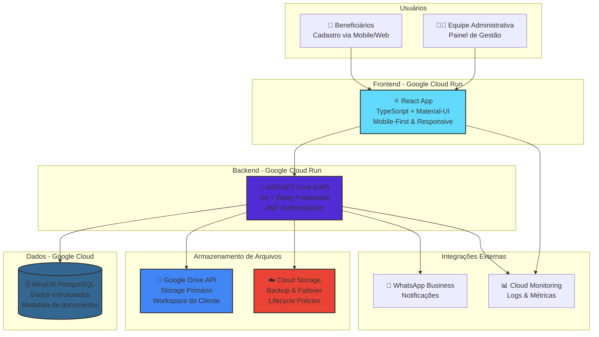

# Casa Mãe Paulistana - Visão Geral da Solução Técnica

**Data:** 04/10/2025  
**Projeto:** Casa Mãe Paulistana  
**Responsável:** CodeBoa Software

---

## 🎯 Visão Geral da Solução

O Casa Mãe Paulistana será desenvolvido como uma aplicação web moderna, econômica e escalável, focada em facilitar o cadastro de beneficiários e gerenciamento de documentos.

### Arquitetura Geral



---

## 💰 Estimativa de Custos (Google Cloud)

### Volume Esperado: 3000 Acessos/Mês
**Cálculo base:**
- 3000 cadastros × 4 documentos = 12000 uploads/mês
- Tamanho médio: 3MB por arquivo (PDFs + fotos)
- Volume mensal: ~36GB de novos documentos
- Volume anual acumulado: ~432GB

| Serviço | Custo Mensal (USD) | Observações |
|---------|-------------------|-------------|
| **Cloud Run (Frontend)** | $25-40 | ~100k page views/mês |
| **Cloud Run (Backend)** | $40-70 | 12k uploads + API calls |
| **AlloyDB PostgreSQL** | $120-180 | 3k transações/mês |
| **Cloud Storage** | $8-12 | 36GB/mês + operações |
| **Google Drive API** | $0 | Workspace existente |
| **Monitoring** | $20-30 | Logs detalhados |
| **TOTAL MENSAL** | **$213-332** | **~R$ 1.200-1.850/mês** |

### Cenário Otimizado (com lifecycle policies)
| Serviço | Custo Mensal (USD) | Observações |
|---------|-------------------|-------------|
| **Cloud Run (Frontend)** | $25-40 | Mesmo volume |
| **Cloud Run (Backend)** | $40-70 | Mesmo processamento |
| **AlloyDB PostgreSQL** | $120-180 | Performance otimizada |
| **Cloud Storage** | $5-8 | Nearline após 90 dias |
| **Google Drive API** | $0 | Workspace existente |
| **Monitoring** | $20-30 | Logs essenciais |
| **TOTAL OTIMIZADO** | **$210-328** | **~R$ 1.170-1.830/mês** |

---

## 🚀 Stack Tecnológica

### Frontend
```typescript
// React 18 + TypeScript + Material-UI
const CadastroForm = () => {
  const [step, setStep] = useState(1);
  const [formData, setFormData] = useState<BeneficiarioData>({});
  
  return (
    <Container maxWidth="md">
      <Stepper activeStep={step}>
        {/* Interface conversational ou formulário */}
      </Stepper>
    </Container>
  );
};
```

### Backend
```csharp
// ASP.NET Core 8 Web API
[ApiController]
[Route("api/[controller]")]
public class BeneficiarioController : ControllerBase
{
    private readonly IBeneficiarioService _service;
    private readonly IDocumentoStorageService _storage;
    
    [HttpPost]
    public async Task<ActionResult<CadastroResult>> CriarCadastro(
        [FromForm] CadastroRequest request)
    {
        // Validação + Upload de documentos + Salvar no banco
        var resultado = await _service.ProcessarCadastro(request);
        return Ok(resultado);
    }
}
```

### Banco de Dados
```sql
-- Schema principal PostgreSQL
CREATE TABLE beneficiarios (
    id SERIAL PRIMARY KEY,
    protocolo VARCHAR(20) UNIQUE NOT NULL,
    nome_responsavel VARCHAR(255) NOT NULL,
    nome_dependente VARCHAR(255) NOT NULL,
    email VARCHAR(255),
    telefone VARCHAR(20),
    preferencia_agendamento TEXT,
    status VARCHAR(50) DEFAULT 'pre_cadastrado',
    created_at TIMESTAMP DEFAULT CURRENT_TIMESTAMP,
    updated_at TIMESTAMP DEFAULT CURRENT_TIMESTAMP
);

CREATE TABLE documentos (
    id SERIAL PRIMARY KEY,
    beneficiario_id INT REFERENCES beneficiarios(id),
    tipo_documento VARCHAR(50) NOT NULL,
    google_drive_file_id VARCHAR(100),
    cloud_storage_path VARCHAR(500),
    tamanho_bytes BIGINT,
    uploaded_at TIMESTAMP DEFAULT CURRENT_TIMESTAMP
);
```

---

## 🔐 Estratégia de Segurança & LGPD

### Criptografia
- **Em Trânsito:** HTTPS/TLS 1.3 para todas as comunicações
- **Em Repouso:** AES-256 (Google Drive & Cloud Storage nativo)
- **API Keys:** Google Service Accounts com scopes mínimos

### Controle de Acesso
```csharp
// JWT Authentication
[Authorize(Roles = "Administrador")]
public async Task<ActionResult> ListarCadastros() { }

// Auditoria de acesso
public async Task LogarAcesso(int beneficiarioId, string acao, string usuario)
{
    await _context.AuditLogs.AddAsync(new AuditLog 
    {
        BeneficiarioId = beneficiarioId,
        Acao = acao,
        Usuario = usuario,
        Timestamp = DateTime.UtcNow,
        IpAddress = HttpContext.Connection.RemoteIpAddress?.ToString()
    });
}
```

### Conformidade LGPD
- **Direito ao Esquecimento:** APIs para exclusão completa
- **Portabilidade:** Export em JSON/PDF
- **Transparência:** Logs de auditoria completos
- **Minimização:** Coleta apenas dados essenciais

---

## 📱 Funcionalidades Principais

### Para Beneficiários
- ✅ **Formulário Público** - Link compartilhável, sem login necessário
- ✅ **Mobile-First** - Otimizado para smartphones
- ✅ **Upload de Documentos** - Câmera ou galeria, até 10MB por arquivo
  - PDF de documentos: até 10MB (acomoda documentos multipáginas)
  - Fotos de documentos: compressão automática mantendo legibilidade
  - Validação de formato e qualidade automática
- ✅ **Pré-agendamento** - Preferência de horário para triagem
- ✅ **Protocolo de Confirmação** - Comprovante de cadastro

### Para Administradores
- ✅ **Painel de Gestão** - Lista de cadastros pendentes
- ✅ **Visualização de Documentos** - Integrado com Google Drive
- ✅ **Agendamento Definitivo** - Confirmar triagens
- ✅ **Notificações** - WhatsApp/Email para beneficiários
- ✅ **Relatórios** - Dashboard com métricas

---

## 🛠️ Plano de Implementação

### Sprint 1 (Semana 1-2): Fundações
- [ ] Setup Google Cloud Project + GitHub repos
- [ ] Configurar AlloyDB e estrutura de dados
- [ ] Implementar autenticação básica
- [ ] Deploy inicial no Cloud Run

### Sprint 2 (Semana 3-4): Formulário de Cadastro
- [ ] Interface React para formulário público
- [ ] API .NET para receber cadastros
- [ ] Integração Google Drive API
- [ ] Sistema de upload de documentos

### Sprint 3 (Semana 5-6): Painel Administrativo  
- [ ] Interface de gestão para administradores
- [ ] Listagem e busca de cadastros
- [ ] Visualização de documentos
- [ ] Sistema de agendamento

### Sprint 4 (Semana 7-8): Integrações e Otimização
- [ ] WhatsApp Business API
- [ ] Monitoramento e alertas
- [ ] Otimização de performance
- [ ] Testes finais e deploy

---

## 🔍 Monitoramento e Observabilidade

### Métricas Importantes
```yaml
# Cloud Monitoring Dashboards
Aplicação:
  - Cadastros realizados/dia
  - Taxa de abandono do formulário
  - Tempo de upload de documentos
  - Erros de API por endpoint

Infraestrutura:
  - CPU/Memory usage (Cloud Run)
  - Latência de requisições
  - Throughput do banco de dados
  - Custos por serviço

Negócio:
  - Conversão de pré-cadastro → triagem
  - Distribuição de tipos de documento
  - Horários de maior demanda
```

### Alertas Configurados
- 🚨 **Erro crítico:** Taxa de erro > 5%
- ⚠️ **Performance:** Latência > 3 segundos
- 💰 **Custos:** Gastos > $100/mês
- 📱 **WhatsApp:** Falha no envio de notificações

---

## 🎯 Próximos Passos

### Decisões Pendentes
- [ ] **Interface conversacional vs formulário tradicional** → Definir baseado em testes de usabilidade
- [ ] **Provedor WhatsApp API** → Comparar Twilio vs Meta Business
- [ ] **Estratégia de testes cross-device** → BrowserStack vs device lab local

### Preparação para Desenvolvimento
1. **Criar Google Cloud Project** e configurar billing
2. **Configurar GitHub repositories** com pipelines CI/CD
3. **Provisionar AlloyDB** e configurar service accounts
4. **Setup Google Drive API** no workspace do cliente
5. **Definir ambiente de desenvolvimento** local

---

## 📚 Documentação de Referência

- 📋 [ADR-002: Arquitetura Técnica](./adrs/ADR-002-arquitetura-tecnica.md)
- 🗄️ [ADR-003: Armazenamento de Documentos](./adrs/ADR-003-armazenamento-documentos.md)  
- 💾 [Estratégia Detalhada de Storage](./docs/estrategia-armazenamento.md)
- 📝 [Especificação da Entrega 1](./specs/entrega-1-22-outubro.md)

---

**Esta solução oferece uma base sólida, econômica e escalável para o Casa Mãe Paulistana, com foco em usabilidade, segurança e conformidade legal.** 🏠✨